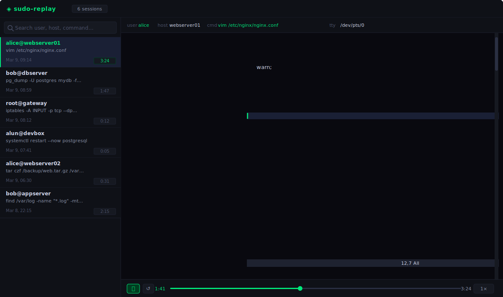

# sudo-logger

Real-time sudo session logging with mandatory remote acknowledgement.
All sudo commands and interactive sessions are recorded and shipped to a
central log server over mutual TLS. If the log server stops responding,
the user's terminal is frozen — preventing any unlogged sudo activity.

## Table of Contents

- [How it works](#how-it-works)
- [Architecture](#architecture)
- [Security properties](#security-properties)
- [Features](#features)
- [Limitations](#limitations)
- [Requirements](#requirements)
- [Installation](#installation)
  - [PKI bootstrap](#1-pki-bootstrap)
  - [Server installation](#2-server-installation)
  - [Client installation](#3-client-installation)
- [Configuration](#configuration)
- [Viewing and replaying sessions](#viewing-and-replaying-sessions)
- [Developer guide](#developer-guide)
  - [Repository layout](#repository-layout)
  - [Building from source](#building-from-source)
  - [Wire protocol](#wire-protocol)
  - [ACK mechanism](#ack-mechanism)
  - [Freeze mechanism](#freeze-mechanism)
  - [Building RPMs](#building-rpms)
- [Performance and capacity](#performance-and-capacity)
- [Troubleshooting](#troubleshooting)

---

## How it works

```
User runs sudo
      │
      ▼
┌─────────────────────┐
│  sudo C plugin      │  Loaded by sudo for every invocation.
│  (plugin.so)        │  Records stdin/stdout/tty I/O.
│                     │  Blocks sudo entirely if shipper is unavailable.
│                     │  Freezes child process if ACKs go stale.
└────────┬────────────┘
         │ Unix socket (/run/sudo-logger/plugin.sock)
         ▼
┌─────────────────────┐
│  sudo-shipper       │  Local daemon running as root.
│  (Go)               │  Bridges plugin ↔ server.
│                     │  Tracks ACK state per session.
│                     │  Responds instantly to ACK queries.
│                     │  Sends heartbeats every 400 ms.
└────────┬────────────┘
         │ Mutual TLS (TCP 9876)
         ▼
┌─────────────────────┐
│  sudo-logserver     │  Central server (separate machine).
│  (Go)               │  Receives session data.
│                     │  Writes sudo iolog directories.
│                     │  Sends HMAC-signed ACKs per chunk.
│                     │  Replies to heartbeats immediately.
└─────────────────────┘
         │
         ▼
  /var/log/sudoreplay/<user>/<host>_<timestamp>/
  Replayed with: sudoreplay -d /var/log/sudoreplay <TSID>
```

When a user runs `sudo`, the plugin connects to the local shipper daemon.
The shipper opens a TLS connection to the remote log server. If the server
is unreachable at this point, sudo is blocked entirely — the command never
runs. If the connection succeeds, sudo proceeds and all I/O is streamed to
the server in real time. The server acknowledges every chunk and replies to
periodic heartbeat probes. If ACKs and heartbeats stop arriving (network
loss, server crash), the child process is frozen within ~1 second — no
further input reaches it until ACKs resume or the session is killed with
Ctrl+C.

---

## Architecture

### C plugin (`plugin/plugin.c`)

A sudo I/O plugin loaded via `/etc/sudo.conf`. Implements the `sudo_plugin.h`
API. Hooks into every sudo session to:

- Connect to the local shipper over a Unix socket at session open
- Forward all terminal input (`log_ttyin`), output (`log_ttyout`), stdin,
  stdout, and stderr as framed chunks
- Run a background monitor thread that polls ACK state every 150 ms and
  writes freeze/unfreeze banners to `/dev/tty` when ACK state changes
- Block sudo entirely if the shipper/server is unreachable at startup
- Actual process freezing is performed by the shipper via cgroup.freeze (see
  [Freeze mechanism](#freeze-mechanism))

### Go shipper (`go/cmd/shipper/`)

A systemd service running as root on each client machine. Acts as a proxy
between the plugin (Unix socket) and the server (TLS). One goroutine per
sudo session:

- Opens a TLS connection to the server for each new session
- Forwards SESSION_START, CHUNK, SESSION_END messages
- Receives and HMAC-verifies ACKs from the server
- Tracks ACK state per session; responds instantly to plugin ACK queries
- Sends a HEARTBEAT to the server every 400 ms; declares the connection
  dead if no HEARTBEAT_ACK arrives within 800 ms (~1 s freeze latency)
- Recovers automatically if the network comes back within ~2 seconds
  (before TCP keepalive closes the connection)
- Creates a per-session cgroup subtree to freeze all child processes
- Tracks processes that escape to foreign cgroups (moved by GNOME/systemd)
  and freezes them via SIGSTOP when safe (see [Freeze mechanism](#freeze-mechanism))

### Go log server (`go/cmd/server/`)

A TLS server running on a dedicated machine. For each client connection:

- Receives session metadata and writes a sudo iolog log file
- Streams terminal I/O into `ttyout`/`ttyin` files with timing data
- Acknowledges every chunk with an HMAC-signed ACK
- Replies to HEARTBEAT probes immediately with HEARTBEAT_ACK
- Sessions stored as sudoreplay-compatible directories under
  `/var/log/sudoreplay/<user>/<host>_<timestamp>/`

---

## Security properties

| Property | Detail |
|----------|--------|
| **Sudo blocked at start** | If the log server is unreachable when sudo runs, the session is rejected before the command executes |
| **Child process frozen on network loss** | If ACKs stop arriving, the child process is frozen within ~1 second |
| **Freeze cannot be escaped with `fg`** | Terminal sessions are frozen via `cgroup.freeze=1` — no job-control signals involved, so `fg` cannot escape the freeze |
| **Ctrl+C always works** | Ctrl+C and Ctrl+\ are forwarded to the child even while frozen; the session can always be killed |
| **Mutual TLS** | Both client and server authenticate with certificates signed by a shared CA; unknown clients are rejected |
| **HMAC-signed ACKs** | Server signs each ACK with HMAC-SHA256; forged ACKs from a network attacker are detected and discarded |
| **Tamper-evident log storage** | Logs are written on a separate server that the sudo-running user has no access to |
| **All I/O captured** | stdin, stdout, stderr, tty input and tty output are all recorded |
| **Path traversal prevention** | User and host fields are validated against `[a-zA-Z0-9._-]{1,64}` before use in filesystem paths |
| **Log directory confinement** | iolog writer verifies the resolved session path stays within the base log directory |

---

## Features

- Full session replay with `sudoreplay` (native sudo iolog format)
- Real-time streaming — no local buffering on the client
- Interactive sessions (bash, vim, etc.) fully recorded including timing
- Freeze within ~1 s of network loss; automatic recovery when network returns
- Terminal sessions (bash, zsh, …) frozen via `cgroup.freeze` — no job control triggered
- GUI programs with own process group (gvim, okular, …) frozen via direct SIGSTOP/SIGCONT
- Scalable: designed for 50+ simultaneous sessions
- RPM packages for Fedora/RHEL with proper systemd integration
- Automatic sudo.conf configuration on client RPM install/uninstall
- Minimal footprint: one small .so on the client + one Go daemon

---

## Limitations

- **Recovery requires fast network return**: if the network outage lasts
  longer than ~2 seconds, TCP keepalive closes the underlying connection.
  At that point the freeze is permanent for the current session — the user
  must Ctrl+C and start a new sudo session. Brief outages (< 2 s) recover
  automatically when the network returns.

- **No session buffer on reconnect**: chunks sent during the window between
  network loss and freeze detection (~400–800 ms) may not be acknowledged.
  The session recording up to that point is intact on the server.

- **One client certificate for all clients** (default setup): the included
  `setup.sh` generates one client certificate shared across all machines.
  For stronger isolation, generate per-machine client certificates.

- **Root on the client machine is not constrained**: the shipper runs as
  root and can be killed, or the plugin .so can be removed from
  `/etc/sudo.conf`. This system is designed to deter and audit, not to
  prevent a fully compromised root from disabling logging.

- **No log rotation**: `/var/log/sudoreplay/` grows without bound. A sample
  logrotate configuration is provided in `sudo-logserver.logrotate` — install
  it to `/etc/logrotate.d/sudo-logserver`. To enforce a maximum session age,
  add a cron job: `find /var/log/sudoreplay -mindepth 3 -maxdepth 3 -type d -mtime +365 -exec rm -rf {} +`

- **GUI programs that share bash's process group are not frozen**: helper
  processes launched by bash that share its process group are dropped from
  freeze tracking — sending SIGSTOP to their group would also stop bash and
  trigger job control. Only GUI apps that have their own process group
  (e.g. gvim after setsid) are frozen via direct SIGSTOP.

- **TTY dimensions not recorded**: terminal size (rows/cols) is not sent to
  the server. Replay will use default dimensions.

- **Requires sudo 1.9+**: uses the sudo 1.9 I/O plugin API.

---

## Requirements

### Server
- Linux (Fedora 43 / RHEL 9+ recommended)
- Reachable on TCP port 9876 from all clients
- `sudo-logger-server` RPM or equivalent

### Client
- Linux with sudo 1.9+
- `sudo-logger-client` RPM or equivalent
- Network access to the log server

### Build dependencies
- `gcc`
- `sudo-devel` (for `sudo_plugin.h`)
- `golang` 1.18+
- `rpm-build` (for RPM packaging)

---

## Installation

### 1. PKI bootstrap

Run once on a secure machine (CA machine). You need `openssl`.

```bash
bash setup.sh /tmp/pki logserver.example.com
```

Replace `logserver.example.com` with the actual hostname or IP of your
log server. This must match the DNS name clients use to connect.

This generates:
```
/tmp/pki/
  ca/ca.crt             # CA certificate (distributed to all machines)
  ca/ca.key             # CA private key (keep secure, not distributed)
  server/server.crt     # Server TLS certificate
  server/server.key     # Server TLS private key
  client/client.crt     # Client TLS certificate
  client/client.key     # Client TLS private key
  hmac.key              # 32-byte HMAC key (distributed to all machines)
```

**File distribution:**

| File | Server | Client |
|------|--------|--------|
| `ca/ca.crt` | Yes | Yes |
| `server/server.crt` | Yes | No |
| `server/server.key` | Yes | No |
| `client/client.crt` | No | Yes |
| `client/client.key` | No | Yes |
| `hmac.key` | Yes | Yes |

---

### 2. Server installation

```bash
# Install RPM
dnf install sudo-logger-server-1.1-6.fc43.x86_64.rpm

# Install certificates
cp /tmp/pki/ca/ca.crt           /etc/sudo-logger/
cp /tmp/pki/server/server.crt   /etc/sudo-logger/
cp /tmp/pki/server/server.key   /etc/sudo-logger/
cp /tmp/pki/hmac.key            /etc/sudo-logger/

# Secure private key and HMAC key
chown sudologger:sudologger /etc/sudo-logger/server.key /etc/sudo-logger/hmac.key
chmod 600 /etc/sudo-logger/server.key /etc/sudo-logger/hmac.key

# Configure listen address and log directory if needed
# Defaults: LISTEN_ADDR=:9876  LOG_DIR=/var/log/sudoreplay
vim /etc/sudo-logger/server.conf

# Start service
systemctl enable --now sudo-logserver

# Verify
systemctl status sudo-logserver
journalctl -u sudo-logserver -f
```

---

### 3. Client installation

```bash
# Install RPM (automatically adds Plugin line to /etc/sudo.conf)
dnf install sudo-logger-client-1.1-22.fc43.x86_64.rpm

# Install certificates
cp /tmp/pki/ca/ca.crt           /etc/sudo-logger/
cp /tmp/pki/client/client.crt   /etc/sudo-logger/
cp /tmp/pki/client/client.key   /etc/sudo-logger/
cp /tmp/pki/hmac.key            /etc/sudo-logger/

# Secure private key and HMAC key
chmod 600 /etc/sudo-logger/client.key /etc/sudo-logger/hmac.key

# Set the log server address
vim /etc/sudo-logger/shipper.conf
# Change: LOGSERVER=logserver.example.com:9876

# Start service
systemctl enable --now sudo-shipper

# Verify
systemctl status sudo-shipper
journalctl -u sudo-shipper -f

# Test
sudo ls
```

The RPM install adds the following line to `/etc/sudo.conf`:
```
Plugin sudo_logger_plugin sudo_logger_plugin.so
```
On uninstall (`dnf remove`), this line is automatically removed.

---

## Configuration

### Client: `/etc/sudo-logger/shipper.conf`

```bash
# Address of the remote log server
LOGSERVER=logserver.example.com:9876
```

All other shipper parameters (certificate paths, socket path) are set in
the systemd unit file `/usr/lib/systemd/system/sudo-shipper.service`.
To override, create a drop-in:

```bash
systemctl edit sudo-shipper
```

#### Verbose debug logging

By default, `sudo-shipper` only logs errors and key events (session start,
freeze/unfreeze). Detailed cgroup operational messages (pid moved, escaped,
frozen state changes, removed) are suppressed to keep journald output clean.

To enable verbose logging for troubleshooting, add `-debug` to the service:

```ini
# /etc/systemd/system/sudo-shipper.service.d/override.conf
[Service]
ExecStart=
ExecStart=/usr/bin/sudo-shipper -debug \
    -server ... -socket ... -cert ... -key ... -ca ... -hmackey ...
```

Or temporarily on the command line:

```bash
sudo-shipper -debug -server logserver:9876 ...
```

Then watch the full output with `journalctl -u sudo-shipper -f`.

### Server: `/etc/sudo-logger/server.conf`

```bash
# Listen address (all interfaces, port 9876)
LISTEN_ADDR=:9876

# Base directory for session logs
LOG_DIR=/var/log/sudoreplay
```

### Tunable constants in `plugin/plugin.c`

| Constant | Default | Description |
|----------|---------|-------------|
| `SHIPPER_SOCK_PATH` | `/run/sudo-logger/plugin.sock` | Unix socket path |
| `ACK_TIMEOUT_SECS` | `2` | Seconds without ACK before plugin-side freeze |
| `ACK_REFRESH_SECS` | `0` | Re-query shipper on every monitor poll (every 150 ms) |
| `ACK_QUERY_TIMEOUT_MS` | `100` | Max wait for ACK_RESPONSE from shipper |

### Tunable constants in `go/cmd/shipper/main.go`

| Constant | Default | Description |
|----------|---------|-------------|
| `ackLagLimit` | `2s` | Unacknowledged chunk age before reporting dead to plugin |
| `hbInterval` | `400ms` | Heartbeat interval; freeze declared after 2 missed replies (800 ms) |

---

## Web replay interface

`sudo-replay-server` is a lightweight HTTP server that provides a browser-based
terminal player for recorded sessions.  It reads the same iolog directories as
`sudoreplay` and requires no database.



```bash
# Install RPM on the log server
dnf install sudo-logger-replay-1.1-2.fc43.x86_64.rpm

# Start the service (runs as sudologger, reads /var/log/sudoreplay)
systemctl enable --now sudo-replay

# Open in browser
xdg-open http://localhost:8080
```

Or run manually:
```bash
sudo-replay-server -logdir /var/log/sudoreplay -listen :8080
```

**Features:**
- Session list with live search by user, host, or command
- **Full command with all arguments** shown in the session list and info bar
  (e.g. `vim /etc/nginx/nginx.conf`, `pg_dump -U postgres mydb -f backup.sql`)
- Terminal player with play/pause, scrubbing, and speed control (0.25×–16×)
- Keyboard shortcuts: `Space` play/pause, `←`/`→` seek ±5 s, `R` restart
- No authentication built in — restrict to a management network or put behind a
  reverse proxy with HTTP basic auth

**How it works:**

The plugin now captures the full `argv` array (not just `argv[0]`) in every
`SESSION_START` message.  The shipper forwards this verbatim to the server,
which writes it as line 3 of the iolog `log` file — the same field that
`sudoreplay -l` and the web interface read as the session command.

> **Security note:** sudo session recordings may contain sensitive data
> (passwords typed, private keys, etc.).  Restrict access to the replay
> interface accordingly.

---

## Viewing and replaying sessions

Sessions are stored on the server in sudo's native iolog format under
`/var/log/sudoreplay/<user>/<host>_<timestamp>/`.

```bash
# List all recorded sessions
sudoreplay -d /var/log/sudoreplay -l

# Replay a session (use the TSID from -l)
sudoreplay -d /var/log/sudoreplay alun/fedora_20260307-112244

# Replay at 2x speed
sudoreplay -d /var/log/sudoreplay -s 2 alun/fedora_20260307-112244

# Replay a specific time range (seconds 10–30)
sudoreplay -d /var/log/sudoreplay -f 10 -t 30 alun/fedora_20260307-112244

# Search sessions by user
sudoreplay -d /var/log/sudoreplay -l -u alun

# Search sessions by command
sudoreplay -d /var/log/sudoreplay -l -c bash
```

Each session directory contains:
```
log     — session metadata (user, host, runas, tty, command, timestamp)
timing  — event timing file (event type, delta seconds, byte count)
ttyout  — terminal output data
ttyin   — terminal input data
```

---

## Developer guide

### Repository layout

```
sudo-logger/
├── plugin/
│   └── plugin.c            # sudo I/O plugin (C)
├── go/
│   ├── go.mod
│   ├── cmd/
│   │   ├── shipper/
│   │   │   ├── main.go     # Local shipper daemon
│   │   │   └── cgroup.go   # Per-session cgroup management + freeze tracking
│   │   ├── server/
│   │   │   └── main.go     # Remote log server
│   │   └── replay-server/
│   │       ├── main.go     # Web replay interface (HTTP + embedded SPA)
│   │       └── static/
│   │           └── index.html  # Single-page terminal player (xterm.js)
│   └── internal/
│       ├── protocol/
│       │   └── protocol.go # Shared wire protocol
│       └── iolog/
│           └── iolog.go    # sudo iolog directory writer
├── rpm/
│   ├── sudo-logger-client.spec  # RPM spec for client package
│   ├── sudo-logger-server.spec  # RPM spec for server package
│   └── sudo-logger-replay.spec  # RPM spec for replay web interface
├── setup.sh                # PKI bootstrap script
├── sudo-shipper.service    # systemd unit for shipper
├── sudo-logserver.service  # systemd unit for server
├── sudo-replay.service     # systemd unit for replay web interface
├── sudo-logserver.logrotate # logrotate config for /var/log/sudoreplay
├── shipper.conf            # Default client config
└── server.conf             # Default server config
```

### Building from source

```bash
# Build the plugin
cd plugin
gcc -Wall -Wextra -O2 -fPIC -shared \
    -I/usr/include/sudo \
    -D_GNU_SOURCE \
    -o sudo_logger_plugin.so plugin.c

# Build the shipper, server, and replay interface
cd go
go build -o sudo-shipper       ./cmd/shipper
go build -o sudo-logserver     ./cmd/server
go build -o sudo-replay-server ./cmd/replay-server
```

### Wire protocol

All messages share a 5-byte frame header:
```
[1 byte: type][4 bytes: payload length, big-endian][N bytes: payload]
```

Implemented in `go/internal/protocol/protocol.go` (Go) and inline in
`plugin/plugin.c` (C).

| Type | Hex | Direction | Description |
|------|-----|-----------|-------------|
| `SESSION_START` | `0x01` | plugin → shipper → server | JSON: session_id, user, host, command, ts, pid |
| `CHUNK` | `0x02` | plugin → shipper → server | Binary: seq(8) + ts_ns(8) + stream(1) + len(4) + data |
| `SESSION_END` | `0x03` | plugin → shipper → server | Binary: final_seq(8) + exit_code(4) |
| `ACK` | `0x04` | server → shipper | Binary: seq(8) + ts_ns(8) + hmac(32) |
| `ACK_QUERY` | `0x05` | plugin → shipper | Empty — plugin requests latest ACK state |
| `ACK_RESPONSE` | `0x06` | shipper → plugin | Binary: last_ack_ts_ns(8) + last_seq(8) |
| `SESSION_READY` | `0x07` | shipper → plugin | Empty — server connection established, sudo may proceed |
| `SESSION_ERROR` | `0x08` | shipper → plugin | String error message — server unreachable, sudo blocked |
| `HEARTBEAT` | `0x09` | shipper → server | Empty — keepalive probe sent every 400 ms |
| `HEARTBEAT_ACK` | `0x0a` | server → shipper | Empty — immediate reply to HEARTBEAT |

**CHUNK stream types:**

| Value | Constant | Description |
|-------|----------|-------------|
| `0x00` | `STREAM_STDIN` | Standard input (non-tty) |
| `0x01` | `STREAM_STDOUT` | Standard output (non-tty) |
| `0x02` | `STREAM_STDERR` | Standard error |
| `0x03` | `STREAM_TTYIN` | Terminal input (what user typed) |
| `0x04` | `STREAM_TTYOUT` | Terminal output (what user saw) |

**ACK HMAC:**

The server signs each ACK with HMAC-SHA256 over the 16-byte sequence:
```
seq_be(8 bytes) || ts_ns_be(8 bytes)
```
using the shared HMAC key. The shipper verifies this before accepting the
ACK. This prevents a network attacker from injecting fake ACKs to allow
unlogged sudo activity.

### ACK mechanism

```
Server ──ACK/HEARTBEAT_ACK──► Shipper (ACK reader goroutine)
                                    │ updateAck() / markAlive() / touchServerMsg()
                                    │
Shipper ──HEARTBEAT──────────► Server (heartbeat goroutine, every 400 ms)
                                    │ markDead() if no reply within 800 ms
                                    │
Plugin ──ACK_QUERY──────────► Shipper (main loop, readAck())
Plugin ◄──ACK_RESPONSE────── (ts=time.Now() if alive, ts=0 if dead)
```

The shipper's `readAck()` returns:

1. `(0, lastSeq)` if `serverConnAlive == false` — connection declared dead
2. `(0, lastSeq)` if unACKed chunks exist and debt age > `ackLagLimit` (2 s)
3. `(time.Now(), lastSeq)` otherwise — server is alive and responding

Recovery: when a `HEARTBEAT_ACK` or `ACK` arrives after a dead period,
`markAlive()` sets `serverConnAlive = true` and calls `cg.unfreeze()`.

### Freeze mechanism

Two complementary freeze mechanisms work together:

**Plugin-side (C):** the background monitor thread polls `ack_is_fresh()` every
150 ms and writes banners to `/dev/tty` on state transitions:

```
monitor thread (every 150 ms)
    │
    ├── ack stale → write FREEZE banner to /dev/tty (once)
    │
    └── ack fresh again → write UNFREEZE banner to /dev/tty
```

The plugin does **not** send any signals. All process freezing is delegated
to the shipper (cgroup-based), keeping the plugin simple and avoiding any
interaction with the kernel's job-control machinery.

**Shipper-side (Go):** the shipper manages a per-session cgroup subtree and
freezes processes at the cgroup level:

```
cgroup.freeze=1  →  all processes in the session cgroup are suspended
```

For processes that escape the session cgroup (moved by GNOME/systemd to
`app-*.scope`), the shipper tracks them and applies per-process SIGSTOP if
safe. Safety is determined by process group membership:

- **Shell processes** (bash, zsh, …): reclaimed back into the session cgroup
  so `cgroup.freeze` covers them. SIGSTOP is never sent to shells — it would
  trigger job control and background the session.
- **Escaped GUI apps with own process group** (e.g. gvim after `setsid`):
  frozen via `syscall.Kill(pid, SIGSTOP)` targeting only that PID directly.
  On unfreeze, `syscall.Kill(pid, SIGCONT)` resumes them.
- **Escaped helpers sharing bash's process group**: dropped from tracking.
  Sending SIGSTOP to their process group would also stop bash and trigger
  job control, so they are left alone.

During a freeze, terminal sessions are suspended via `cgroup.freeze=1` and
the plugin writes the freeze banner to the terminal. When the network returns,
the cgroup is unfrozen and the banner clears automatically. If bash was moved
out of the session cgroup and ended up backgrounded (visible as
`[1]+ Stopped sudo bash` in the parent shell), run `fg` to restore it.

`log_ttyin()` always returns 1 and never blocks. Blocking there would
prevent sudo's event loop from processing signals, breaking Ctrl+C.

### Building RPMs

The RPM spec files are in `rpm/` in the repository.

```bash
# Set up rpmbuild tree (once)
rpmdev-setuptree

# Copy spec files
cp rpm/sudo-logger-client.spec rpm/sudo-logger-server.spec ~/rpmbuild/SPECS/

# Create source tarball from the repo root
VERSION=1.1
tar czf ~/rpmbuild/SOURCES/sudo-logger-${VERSION}.tar.gz \
    --transform "s,^,sudo-logger-${VERSION}/," \
    go/ plugin/ sudo-shipper.service sudo-logserver.service \
    shipper.conf server.conf

# Build client RPM
rpmbuild -bb ~/rpmbuild/SPECS/sudo-logger-client.spec

# Build server RPM
rpmbuild -bb ~/rpmbuild/SPECS/sudo-logger-server.spec

# RPMs end up in:
ls ~/rpmbuild/RPMS/x86_64/
```

**Version bump:** increment `Release:` in the spec file(s) for patch changes.
Increment `Version:` and the tarball name for new minor/major versions.

---

## Container deployment (Podman)

The repository includes a `Dockerfile` and `docker-compose.yaml` for running
the log server and web replay interface as containers. The plugin and shipper
still run natively on client machines — only the server side is containerised.

Containers run as the distroless nonroot user (UID 65532). Because rootless
Podman uses a user namespace, file ownership on bind mounts and named volumes
must be set up once with `podman unshare` before first start.

### Prerequisites

- `podman` and `podman-compose`
- A `pki/` directory with the server-side certificates (see
  [PKI bootstrap](#1-pki-bootstrap))

```
pki/
├── ca.crt
├── server.crt
├── server.key    ← must be readable only by the container user
├── hmac.key      ← must be readable only by the container user
└── server.conf   ← optional: override LISTEN_ADDR / LOG_DIR
```

### First-time setup

Run once after creating the `pki/` directory:

```bash
# 1. Fix ownership of pki/ so the nonroot container user (65532) can read it
podman unshare chown -R 65532:65532 ./pki/

# 2. Lock down private keys
podman unshare chmod 600 ./pki/server.key ./pki/hmac.key

# 3. Build the image
podman-compose build

# 4. Pre-create the log volume and fix its ownership before first start
podman volume create sudo-logger_sudologs
podman unshare chown -R 65532:65532 \
    $(podman volume inspect sudo-logger_sudologs --format '{{.Mountpoint}}')

# 5. Start
podman-compose up -d
```

### Start

```bash
podman-compose up -d
```

### Stop

```bash
podman-compose down        # stop and remove containers, keep logs
podman-compose down -v     # also delete the session log volume
```

### View logs

```bash
podman-compose logs -f             # both services
podman logs -f sudo-logserver      # logserver only
podman logs -f sudo-replay-server  # replay server only
```

### Rebuild after code changes

```bash
podman-compose down
podman-compose build --no-cache
podman-compose up -d
```

### Access session logs from the host

Session recordings are stored in the named volume `sudo-logger_sudologs`.
To find the path on disk (e.g. for `sudoreplay` or backup):

```bash
podman volume inspect sudo-logger_sudologs --format '{{.Mountpoint}}'
```

To replay a session directly from the host:

```bash
sudoreplay -d \
    $(podman volume inspect sudo-logger_sudologs --format '{{.Mountpoint}}') \
    alun/fedora_20260311-175401
```

### Fixing permission errors after a failed start

If containers were previously started as root (`user: "0:0"`) or files were
created with wrong ownership, fix recursively and restart:

```bash
podman-compose down
podman unshare chown -R 65532:65532 \
    $(podman volume inspect sudo-logger_sudologs --format '{{.Mountpoint}}')
podman unshare chown -R 65532:65532 ./pki/
podman-compose up -d
```

### Production readiness

| # | Item | Status |
|---|------|--------|
| ✅ | Distroless base image (minimal attack surface) | Good |
| ✅ | Runs as nonroot UID 65532 | Good |
| ✅ | Named volume (no bind mount permission issues) | Good |
| ✅ | Replay server mounts log volume read-only | Good |
| ⚠️ | Replay server has no authentication | Put behind a reverse proxy with HTTP basic auth before exposing beyond localhost |
| ⚠️ | No `no-new-privileges` / `cap_drop: ALL` | Add to both services for defence in depth |
| ⚠️ | No resource limits | Add `deploy.resources.limits` for memory/CPU |
| ⚠️ | No healthcheck | `depends_on` does not wait for logserver to be ready |

---

## Kubernetes deployment

### Why not standard Ingress?

sudo-logserver speaks raw TCP with mutual TLS. Standard Kubernetes Ingress
is HTTP/HTTPS only and terminates TLS — this breaks mTLS. Use a
`LoadBalancer` Service instead (TCP passthrough).

### Quick start

```bash
# 1. Create namespace
kubectl apply -f k8s/namespace.yaml

# 2. Load PKI files as a Secret (run setup.sh first)
bash k8s/create-secret.sh /path/to/pki

# 3. Deploy
kubectl apply -k k8s/

# 4. Get the external IP
kubectl get svc -n sudo-logger sudo-logserver

# 5. Update shipper.conf on all clients
# LOGSERVER=<EXTERNAL-IP>:9876
```

### Security notes

- The container runs as UID 65532 (distroless `nonroot`) with a read-only
  root filesystem and all Linux capabilities dropped.
- TLS private key and HMAC key are mounted read-only from a Kubernetes
  Secret (`defaultMode: 0400`).
- Consider using `loadBalancerSourceRanges` in `service.yaml` to restrict
  which IP ranges can reach port 9876.

---

## Performance and capacity

| Resource | Per session |
|----------|-------------|
| Goroutines | 3 (main loop + ACK reader + heartbeat) |
| Memory | ~100–200 KB |
| File descriptors | 4 |

**FD limit** is the first hard limit. At 4 FD/session the default limit of
1 024 caps at ~250 sessions. Add `LimitNOFILE=65536` to the server service
file to raise this to ~15 000+ sessions.

**Known resource leak:** a shipper that disappears without sending
`SESSION_END` leaves a goroutine and 4 FDs open on the server. Add a
`RuntimeMaxSec=` to the server's systemd unit or a Kubernetes liveness
probe to restart periodically.

---

## Troubleshooting

### `sudo: error in /etc/sudo.conf: unable to load plugin`

```bash
ls -la /usr/libexec/sudo/sudo_logger_plugin.so
grep Plugin /etc/sudo.conf
# Expected: Plugin sudo_logger_plugin sudo_logger_plugin.so
```

### `sudo-logger: cannot connect to shipper daemon`

```bash
systemctl status sudo-shipper
journalctl -u sudo-shipper -n 50
ls /run/sudo-logger/plugin.sock
```

### `sudo-logger: cannot reach log server: tls: ...`

- **`x509: certificate is not valid for any names`**: regenerate with the
  correct server hostname: `bash setup.sh /tmp/pki your-actual-hostname`
- **`x509: certificate signed by unknown authority`**: CA cert mismatch
  between client and server.

### Terminal freezes and network has returned

If the freeze banner is visible and the network is back, the session should
resume automatically within ~1 second once a `HEARTBEAT_ACK` arrives.

If bash was suspended by job control (visible as `[1]+ Stopped sudo bash`
in the parent shell), run `fg` to bring it back to the foreground.

### Terminal freezes and `fg`/network does not resume

If the network was down for > 2 s, the TCP connection is gone and the
session cannot recover. Use Ctrl+C to kill the frozen session, wait for
the network to return, then start a new `sudo` session.

### Terminal freezes immediately on session start

The shipper cannot reach the server or the HMAC key differs:
```bash
journalctl -u sudo-shipper -n 50
# On the server:
journalctl -u sudo-logserver -n 50
```

### Freeze is too slow after network loss

Ensure you are running client ≥ 1.1-22 and server ≥ 1.1-6. Earlier versions
used TCP keepalive only (~2 s latency). Current versions use heartbeats (~1 s).
